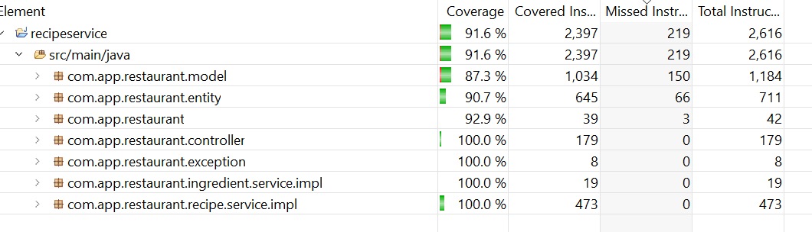

# Recipe Service API overview
- Recipeservice application is to manage favourite recipes
- Handled recipe operations : create, update,delete,get all recipes, filter recipes by given search conditions.
- While create/update/delete/get recipe from the database it create/update/delete/get relevant recipe instruction,recipe ingredient information into/from the database.

## Technology Stack
- Java 11
- Spring Boot 2.7.9
- Junit 5.8.2
- Database H2

## Architectural Design

## Entity Relationship Diagram

## Code Coverage

## Application Running Instructions
 
  - How to run application in local
    - mvn clean install
    - mvn spring-boot:run
  - Run jar using below command
  	- java -jar <jar-location>\recipeservice-1.0.jar
  - Test Endpoint.
  	- curl -X GET "http://localhost:8080/recipeservice/recipes"
  	
## Swagger Documentation
 - [Application URL](http://localhost:8080/recipeservice/swagger-ui/) (Prerequisite: The application should be running on port number : 8080)

## Accessing H2 Database
 - [Database URL](http://localhost:8080/recipeservice/h2)  (Prerequisite: The application should be running on port number : 8080)

## Initial Data
 - [Download Here](files/InitialData.xlsx)
 - On startup application will load initial data. You can Add/Modify existing data in src/main/resources/data.sql
 
## Achieved Functionalities
   - Create Recipe
   - Update Recipe
   - Delete Recipe
   - Get All Recipes
   - Filter All Recipes by given search condition
   - Integration Test (RecipeServiceControllerIT.java)
   - Unit test 
   - Swagger Documentation
   